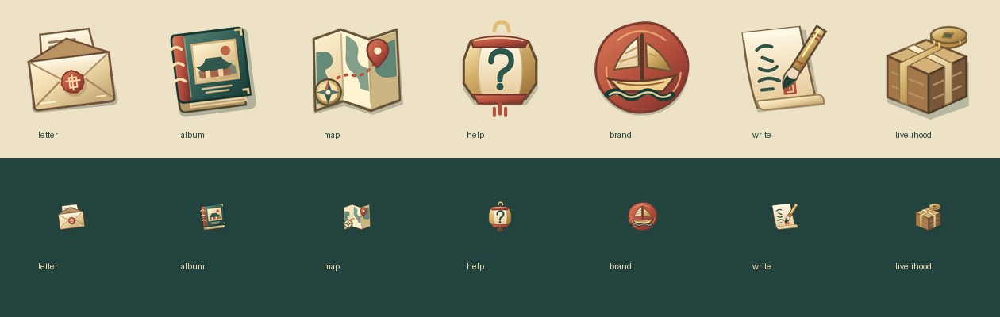
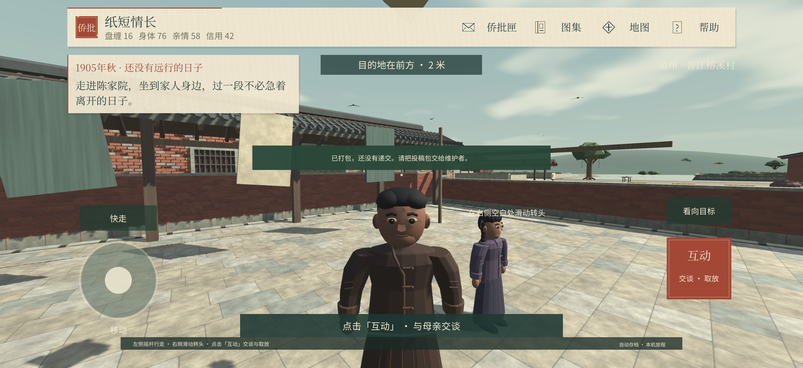
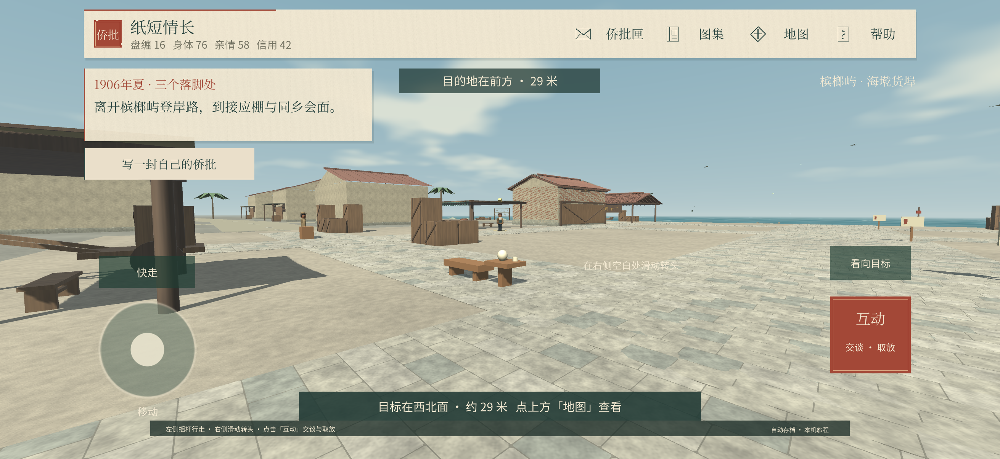

# 侨批 · 纸短情长

从泉州出发，亲自走一段华侨人生。Unity 2.0 版中文第一人称 3D 剧情游戏，包含可编辑的完整工程、人物模型、原创配乐与侨批系统。

**[下载游戏](https://github.com/BF642/qiaopi-game/releases/latest)** · **[下载 Unity 工程 ZIP](https://github.com/BF642/qiaopi-game/archive/refs/heads/main.zip)** · **[参与修改](CONTRIBUTING.md)** · **[路线与八种结局](2.0路线与游玩说明.md)**

2.0.3：重新绘制七枚带实物造型的功能图标：朱印信封、线装册、折页地图、引路灯笼、帆船徽记、毛笔家书与货箱钱币。透明背景保持不变，手机图标加大；附SVG源文件供继续修改。0～100属性条和上一版通透界面保留。



## 这一版能玩什么

- 从1905年泉州一家人的安稳生活开始，经历灾后生计、债务与欺压，决定出洋。
- 首次落脚地随机为新加坡、槟榔屿或仰光，随存档固定；环境、抵埠对话与受挫事件有所不同。
- 扛货、理货、送批、休息、寄家用：海外阶段自由安排3～6轮生活，工作需要在三维场景里亲自完成，可以换行。
- 遭遇扣薪、勒索或逐客后，选择留证追问、结伴换工，或暂且忍下，影响后续身体、盘缠与信用。
- 自己写侨批、附银、存稿、收到回批。每程最多3封、每封1200字符。原文仅存于本机；回信根据所选心意与附银生成。
- 17次主线选择、8类人生结局。单局设计目标25～40分钟，尚未经真人完整计时。三地共用侨批主线，并非三套独立长篇故事。

## 下载和运行

**Mac**：到上方 Releases 下载 `qiaopi-v2.0.3-macOS.zip`，解压后打开应用。支持 Apple Silicon 与 Intel。公开下载版未做 Apple 公证；本项目不提供关闭系统安全保护的操作。也可以在自己的 Unity 环境从源码运行或构建。

**iPhone**：仓库包含 iOS 导出代码，需要在 Mac 上安装 Xcode、Unity iOS Build Support，使用自己的 Apple 开发签名构建安装。这里不发布绑定原测试设备的安装包。

**Windows / Linux**：可以查看和修改源码，但目前没有发布或验证这两个平台的成品。

公开版保留全部文字、角色、原创音乐和音效，暂不附带原本机系统语音生成的配音。其分发限制与后续替换方法见 [素材与第三方说明](THIRD_PARTY_NOTICES.md)。

## 用 Unity 修改

1. 安装 Unity Hub 与 **Unity 6000.6.0f1**，添加本仓库根目录（包含 `Assets`、`Packages`、`ProjectSettings`）。
2. 打开 `Assets/Scenes/Qiaopi.unity`，点击 Play。
3. 游戏场景由代码生成，主要修改位置见 [CONTRIBUTING.md](CONTRIBUTING.md)。
4. Mac 导出：Unity 菜单 **侨批 → 导出 Mac 游戏**，会先运行项目检查，再输出到 `Builds/`。
5. iPhone 导出：先在 Unity 中切换到 iOS 构建目标，再选 **侨批 → 导出 iPhone 测试版**。在 Xcode 中选自己的 Team；也可通过 `QIAOPI_TEAM_ID` 环境变量设置。

克隆命令：

```sh
git clone https://github.com/BF642/qiaopi-game.git
```

Blender 源文件在 `美术源文件/`；可编辑音乐 MIDI、谱面及生成器在 `音乐源文件/`。工程直接包含资源，不要求 Git LFS。

## 操作与保存

- **WASD** 行走，**Shift** 快走，**按住鼠标右键** 转头，**E** 互动。
- **Enter / 空格** 推进对话，**1、2、3** 选择回答。
- **J** 侨批匣，**M** 地图与行路记，**G** 图集，**Esc** 帮助或收起面板。
- iPhone 横屏：左侧摇杆行走、右侧滑动转头、点“互动”。
- 自动保存本机进度。旧存档继续原旅程；体验新序章和随机航线需主动“重新启程”。
- 图集投稿仅生成本地资料包，目前没有自动上传入口；不要把私人侨批或家庭信息直接贴进公开 Issue。

## 一起完善

点 **Fork** 建立自己的副本，修改后提交 **Pull Request**，由维护者审阅合并。任何人都能下载公开仓库；直接向本仓库推送则需要维护者单独邀请。详细说明见 [参与修改](CONTRIBUTING.md)。

允许下载、运行、学习和协作修改本项目原创内容；具体范围见 [协作使用说明](协作使用说明.md)。第三方字体仍遵循其原有许可。

## 创作与验证

人物、村庄、遭遇和家书为虚构，示意侨批不作为历史档案。见 [文化参考](2.0海外目的地与文化参考.md)、[史料与创作说明](史料与创作说明.md)、[公开版验证记录](验证记录.md)。



